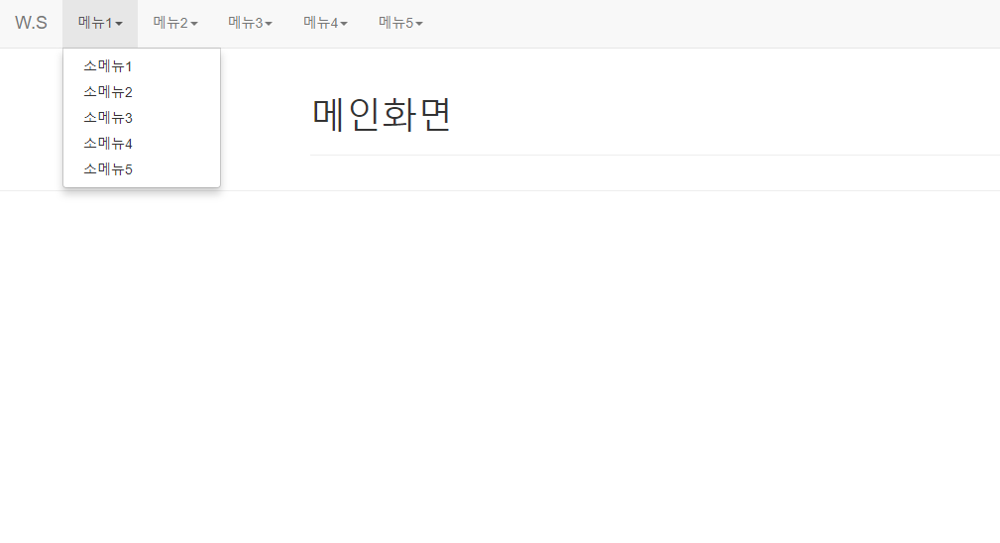
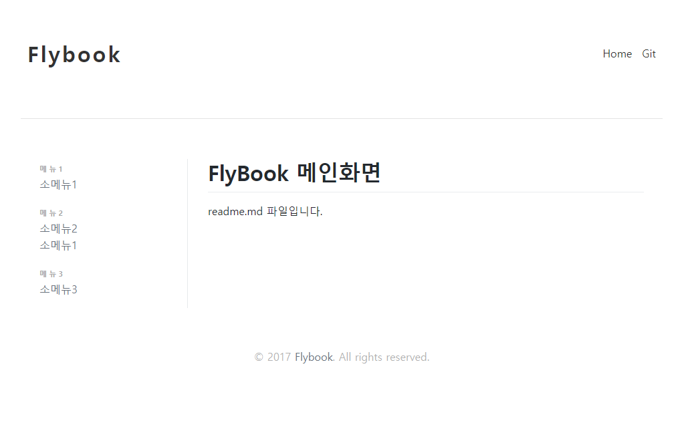
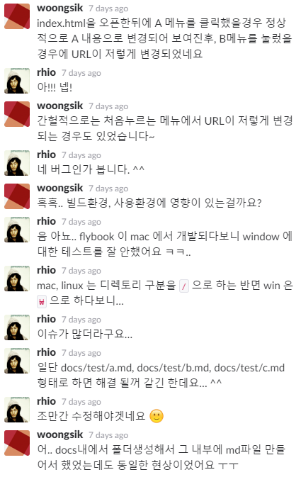

업무에 쪼끔은 도움을 줄 도구 FlyBook
=====

`타자치는 개발자 - 김의태`

* Markdown 문서를 따로 셋팅을 하지 않아도 자동으로 게시판 구조로 만들어주는 도구

### Markdown 이란?

* 일반 텍스트 문서의 양식을 편집하는 문법이다.<br/>
  README 파일이나 온라인 문서, 혹은 일반 텍스트 편집기로 문서 양식을 편집할 때 쓰인다.<br/>
  마크다운을 이용해 작성된 문서는 쉽게 HTML 등 다른 문서형태로 변환이 가능하다.

### 사용하게된 계기

* 예전 어느 세미나에서, FlyBook 개발자가 발표하는걸 보고 관심이 생겼었고,<br/>
기존에도 Markdown을 사용하고있어서 사용해 보게 됐다.

* 아래는 기존에 사용하던것을 간단하게 구성해 보았다.



* 상단 메뉴, 내용(Content)가 각각의 Markdown 파일로 관리 된다.
* 즉, 새로운 카테고리가 추가가 되면 메뉴정의, 내용(Content)파일을 새로 정의 해야 한다.


### 왜 FlyBook인가?
* 쉽고 단순하고 간단하다.<br/>
기존의 사용하던 방식과는 다르게 하나하나 신경쓸 필요가 없다.<br/>
* Folder와 Markdown 파일만 만들어 놓으면 알아서 구조를 잡아 위의 화면과 비슷하게 만들어 준다.
* 해야할일(To-Do), 메모, 이슈 등을 기록해 놓기 위해.
* 여러사람이 업무를 하는경우 기록한것들을 공유하기 위해.


### 이제 본격적으로 사용을 해보자. 간단하다.

* FlyBook은 node 모듈 중 하나이다. 그렇기에 node는 필수로 설치 되어있어야 한다.
* 먼저 flybook 모듈을 설치 한다.
```
npm install flybook
```

* package.json에 아래 script를 추가한다.
```
"docs": "flybook docs --outdir=out"
```
> --outdir=*`out`* : 내보낼 폴더명<br/>
> 위 Script는 사용편의성을 위해 추가 하는것이고, 필수 사항은 아니다.

* 페이지 설정 항목을 추가 한다.
```
  "name": "PROJECT",
  "description": "PROJECT Description",
  "homepage": "",
  "repository": {
    "url": "",
    "type": "git"
  },
  "author": {
    "name": "Woongsik Kim",
    "email": "",
    "url": ""
  },
```

> name : 홈 BANER<br/>
> description : 프로젝트 설명<br/>
> homepage : 홈페이지 URL<br/>
> repository - url : 개인 저장소 URL<br/>
> author : 사용자 정보(이름,이메일,개인홈페이지URL)


* 디렉토리 구조를 아래와 같이 만든다.
  * 디렉토리 구조안의 `readme.md` 파일은 **필수**로 있어야 한다. 첫 메인화면에 보여지는 파일로 생각 하면 된다.
`````
docs
|____메뉴1
| \____소메뉴1.md
|____메뉴2
| \____소메뉴1.md
| \____소메뉴2.md
|____메뉴3
| \____소메뉴1.md
|____readme.md
`````

* 위의 디렉토리 구조를 만든 후 아래 명령어를 실행만 하면 구조화 되어 `html` 파일로 만들어 진다.
  * `npm run docs`

`````
out
|____메뉴1
| \____소메뉴1.html
|____메뉴2
| \____소메뉴1.html
| \____소메뉴2.html
|____메뉴3
| \____소메뉴1.html
|____index.html
...
`````

* `index.html` 파일을 열면 초기화면을 확인 할 수 있다.
* 폴더는 메뉴로, Markdown 파일명이 소메뉴명(링크)으로, Markdown내용이 소메뉴의 내용으로.




### 기능을 봤으니 이젠 흠을 한번 보자. 흠이 있다.

* 모든것은 완벽할수 없듯이 FlyBook에도 치명적(?)인 흠이 존재 했다.
> 인코딩 과정에서 정상적으로 변환되지 않는 현상이 발생.. 아스키코드!!<br/>
> URL 경로에 `%5C`로 입력되서 정상적으로 링크를 열지 못하는 현상 발생!!<br/>
> 예로, 정상 URL은 'http://loacalhost:8080/메뉴1/소메뉴.html' 이지만<br/>
> 'http://localhost:8080/메뉴1/.%5C소메뉴1.html' 로 표현된다.<br/>
> 어떻게 시도를 해도 계속되는 현상. 답답한 마음에 FlyBook 개발자에게 문의.<br/>
> 아래와 같은 답변을 얻을수 있었다.



<br/><br/>
# 네. 버그가 수정될 때 까지는 Window 환경보단 Linux 환경에서 빌드 하는걸로..

<br/><br/><br/><br/>
### 참고링크
#### [FlyBook github](https://github.com/rhiokim/flybook)